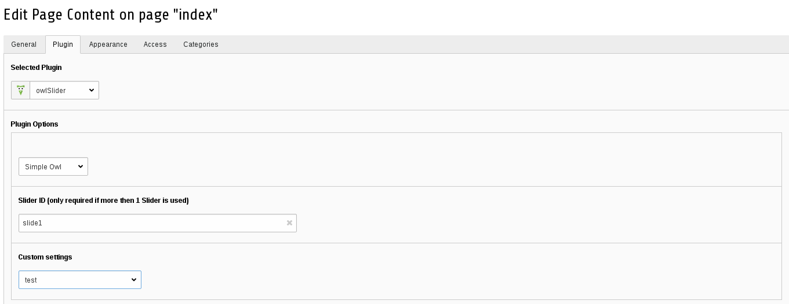

.. ==================================================
.. FOR YOUR INFORMATION
.. --------------------------------------------------
.. -*- coding: utf-8 -*- with BOM.

.. ==================================================
.. DEFINE SOME TEXTROLES
.. --------------------------------------------------
.. role::   underline
.. role::   typoscript(code)
.. role::   ts(typoscript)
:class:  typoscript
.. role::   php(code)

Custom settings for each slider on page
==============================

You could add more than one slider on the same page and add different settings to
to each slider.
To to that, you need to write a TypoScript with this settings.

We give you an example of TypoScript configuration:

:typoscript:`plugin.tx_owlslider.settings.predef.example {
        name = example

        settings {
            items = 2
            random = true
            navigation = true
        }
    }`

IMPORTANT!!
name must be exact the string of predef
    predef.example
    name = example

You can locate this TypoScript file wherever you want.
At least it's important to include this script in your setup.ts of your project,
so your configurations are included in the page template where your owl_slider is active
or in parent page template e.g. in your root page.

Choosing your custom settings for owl_slider
--------------------------------------------
After you have created and included the TypoScript with your custom settings to your template,
you will be able to choose the settings in the plugin configuration in Typo3 backend.

Now just save your changes and your custom settings should apply for this slider.