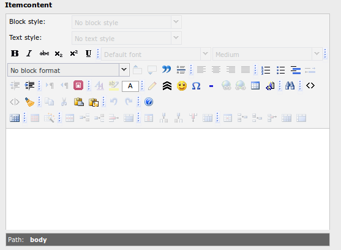
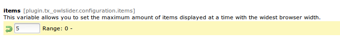
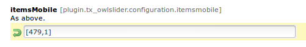


.. ==================================================
.. FOR YOUR INFORMATION
.. --------------------------------------------------
.. -*- coding: utf-8 -*- with BOM.

.. ==================================================
.. DEFINE SOME TEXTROLES
.. --------------------------------------------------
.. role::   underline
.. role::   typoscript(code)
.. role::   ts(typoscript)
   :class:  typoscript
.. role::   php(code)

Custom navigation and text
==============================

You can replace this type of navigation:

  .. image:: ../../Images/Configuration_Nav01.png

  
with this one:

  .. image:: ../../Images/Configuration_Nav02.png

  
To do so you need to set  **customNavigation** true in the backend:

  .. image:: ../../Images/Configuration_CustNav.png

  
.. note::
   Don't forget to disable standard  **navigation**. Otherwise you will
   have both navigations displayed on your page.

Adding content to an image
--------------------------
You can add some text to each sliding image by adding content in the
"Rich Text Editor" in backend-menu of every Item or just one or two
Items you want to upload:

This content will be displayed beneath the slide you've chosen.

Items per page
--------------

In order to prevent Images of laying over each other or to be just cut
off because there is not enough space for all of them, you need to
specify the maximum amount of images that will be displayed on your
page by changing the following  **items** setting:

  
For mobile Webpages that are being displayed on Smartphones and
Tablets as well , the settings  **itemsMobile** and  **itemsDestop**
should be specified if the default specifications don't fit.

e.g.

The format is [x,y] whereby x=browser width and y=number of slides
displayed.