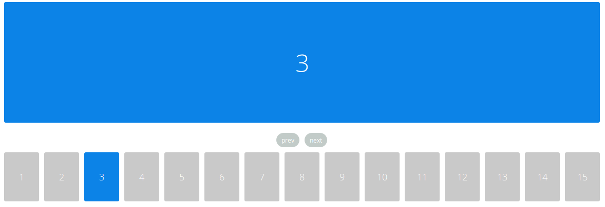
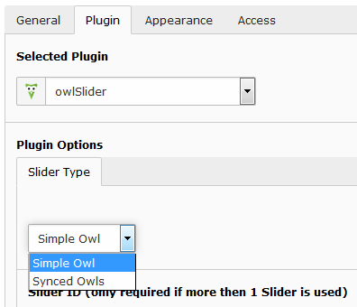

.. ==================================================
.. FOR YOUR INFORMATION
.. --------------------------------------------------
.. -*- coding: utf-8 -*- with BOM.

Modus
=============
In the backend you can choose between two modus "single" or "synced".

.. image:: ../../Images/modus_backend.png

Single
------

With the single mode you can display a single slider.

Synced
------

If you want your slider look like something like this

The each content-element of a slide is synchronized with its slide-element. 
All content-elements are displayed at once, but each of them if clicked scrolls the slider to the maching slide.

To see how it works and to try it out please visit http://www.landmarkmlp.com/js-plugin/owl.carousel/

In order to make your slider look like “Synced Owls”-version you
simply need to choose Synced Owls oprion in the dropdown menu by
editing the slider-element on your page in backend like shown below:

Than save your changes and you are good to go.

.. important::
   Please reinstall your owlSlider Plugin if you're updating it from the version lower than 2.0.0
