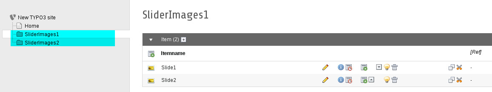
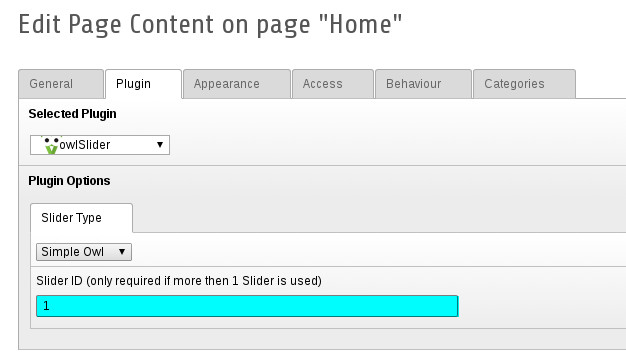


.. ==================================================
.. FOR YOUR INFORMATION
.. --------------------------------------------------
.. -*- coding: utf-8 -*- with BOM.

.. ==================================================
.. DEFINE SOME TEXTROLES
.. --------------------------------------------------
.. role::   underline
.. role::   typoscript(code)
.. role::   ts(typoscript)
   :class:  typoscript
.. role::   php(code)

Multiple sliders
----------------
With this extension you can have multiple sliders on the same page:

For example:

.. image:: ../../Images/Multipage_Sliders.png

Create a sysfolders with owlslider items:
""""""""""""""""""""""""""""""""""""""""""

Set the Record Storage Page for each slider:
"""""""""""""""""""""""""""""""""""""""""""""

.. image:: ../../Images/Multipage_RecordStorage.png

Set the Slider Id:
""""""""""""""""""

